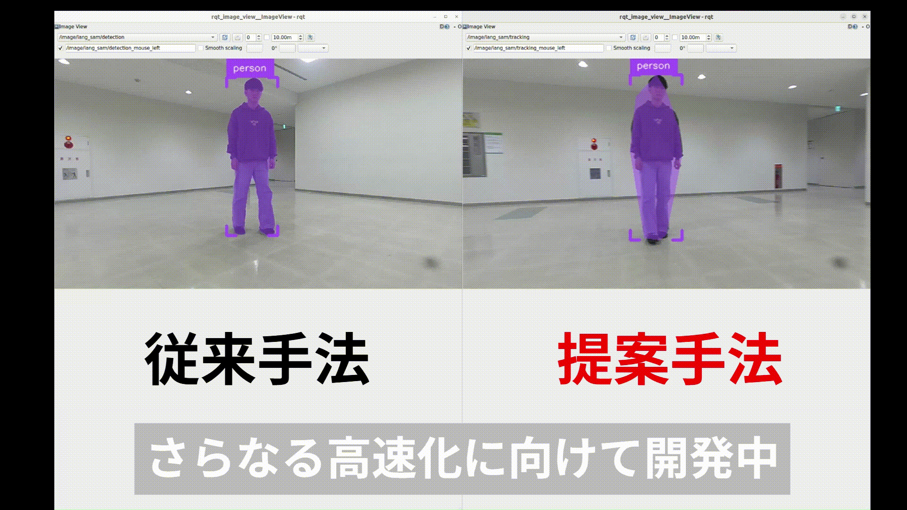

### lang_sam_ros2

本手法は，Language Segment-Anything にKLTトラッカー（Kanade-Lucas-Tomasi Feature Tracker）を導入することで，ゼロショットで高速なトラッキングを実現します．ROS 2環境での利用に対応しています．

[[Paper](doc/si2025_main1.pdf)]

---
#### 概要（後日修正予定）
下図左は LangSAM の出力，右はそのマスクをKLTトラッカーでトラッキングした出力です．

<p align="center">
  
</p>


---
#### lang-segment-anythingのインストール
https://github.com/luca-medeiros/lang-segment-anything

---
#### このリポジトリのインストール
```bash
mkdir -p ros2_ws/src
cd ros2_ws/src
git clone https://github.com/open-rdc/lang_sam_ros2.git
cd ~/ros2_ws
colcon build --symlink-install
source install/setup.bash
```
---
#### 起動

##### 単一マシンで動作確認する場合
```bash
ros2 launch lang_sam_executor lang_sam_executor.launch.py
```

##### 2台構成(LangSAM検出をリモートPCで動かす場合)
LangSAM(GroundingDINO+SAM2)による検出はGPU負荷の大きいリモートPCで、Cutie(VOS)による追跡と追従制御はロボット側PCで動かす構成に対応している。両PCが同一LAN上にあり、同一の`ROS_DOMAIN_ID`を使用していることが前提(DDSの標準的なマルチキャスト探索を利用するため、異なるネットワーク越しの接続には別途VPNやDiscovery Serverなどの追加設定が必要)。

リモートPC(GPU側、`lang_sam_detector`パッケージのみビルドすればよい):
```bash
export ROS_DOMAIN_ID=<両PC共通のID>
ros2 launch lang_sam_executor lang_sam_detector.launch.py
```

ロボット側PC(`lang_sam_tracker`, `lang_sam_person_following`):
```bash
export ROS_DOMAIN_ID=<両PC共通のID>
ros2 launch lang_sam_executor lang_sam_tracker.launch.py
```

---
#### License
This project is licensed under the Apache 2.0 License

